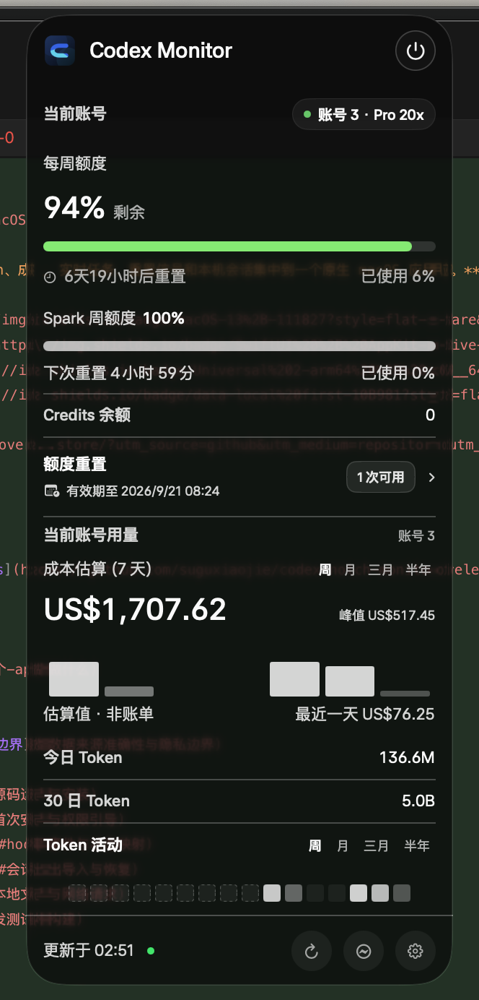
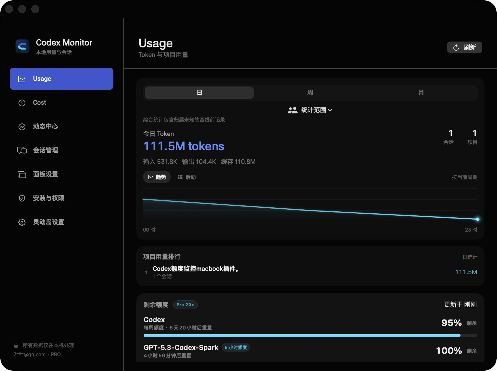
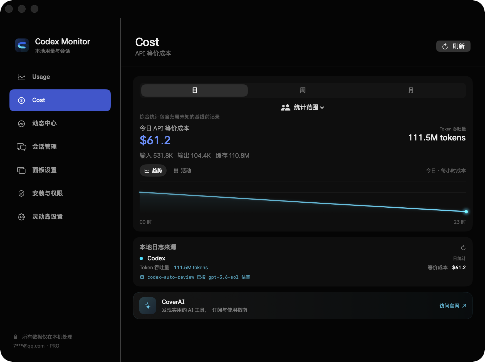
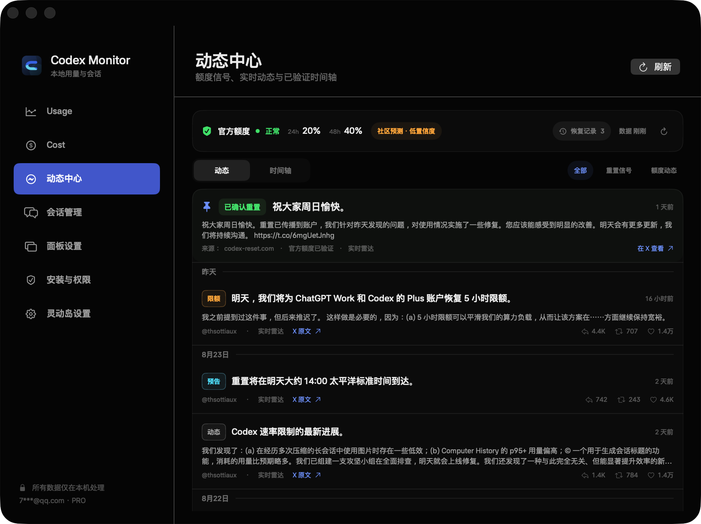
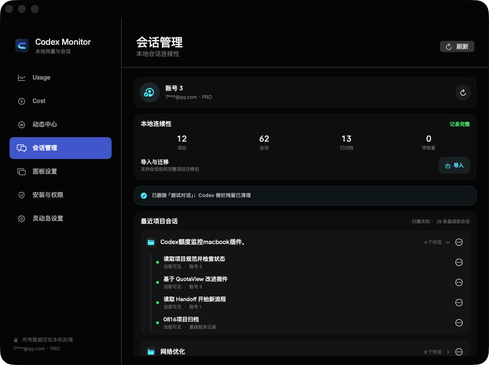
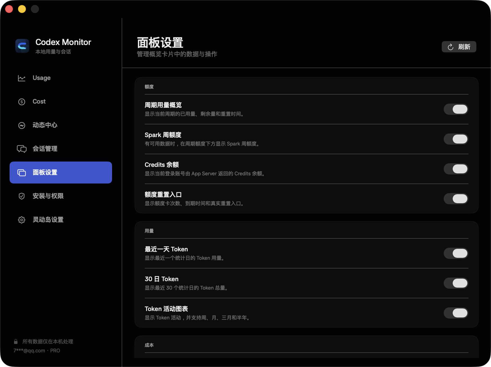
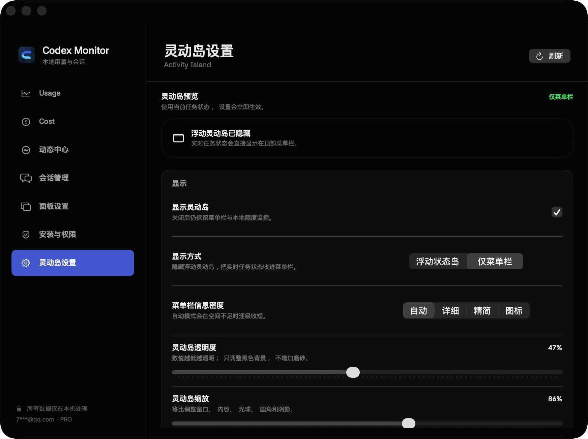
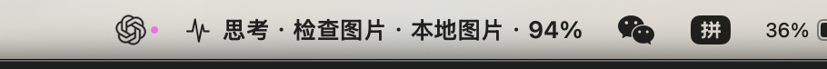

<div align="center">

<p><a href="README.md">简体中文</a> · <strong>English</strong></p>

# Codex Monitor for macOS

**A native macOS app that brings Codex quotas, tokens, cost estimates, live tasks, reset signals, and local sessions into one place.**

[](https://www.apple.com/macos/)
[](Package.swift)
[](scripts/build-app.sh)
[](#data-sources-accuracy-and-privacy-boundaries)
[](LICENSE)

</div>

> [!IMPORTANT]
> The latest version is [`v1.5.2 (Build 13)`](https://github.com/suguxiaojie/codex-notch-monitor/releases/tag/v1.5.2). The Release provides separate DMGs for Apple Silicon `arm64` and Intel `x86_64`; choose the package that matches your Mac.

> [!TIP]
> **Sponsor: CoverAI top-up service** — [Visit CoverAI](https://www.coverai.store/)

## Table of contents

- [What this app does](#what-this-app-does)
- [Interface preview](#interface-preview)
- [Feature details](#feature-details)
- [Data sources, accuracy, and privacy boundaries](#data-sources-accuracy-and-privacy-boundaries)
- [System requirements](#system-requirements)
- [Build and install from source](#build-and-install-from-source)
- [First-run setup and permissions](#first-run-setup-and-permissions)
- [Hook events and status mapping](#hook-events-and-status-mapping)
- [Session export, import, and recovery](#session-export-import-and-recovery)
- [Local files and network requests](#local-files-and-network-requests)
- [Development, testing, and builds](#development-testing-and-builds)
- [FAQ](#faq)
- [Known limitations](#known-limitations)

## What this app does

Codex Monitor is a native macOS menu bar app built with SwiftUI and AppKit. It organizes information that would otherwise be spread across Codex App Server, local session logs, Codex lifecycle Hooks, and public community signals into three usage layers:

1. **Menu bar and Glance panel**: quickly check the current account's quota, reset time, Credits, cost estimate, and token activity.
2. **Activity Island and task status**: follow task execution, tool calls, approval waits, and completion without switching back to Codex.
3. **Monitor Center**: inspect Usage, Cost, Dynamic Center, Session Management, Panel Settings, Setup & Permissions, and Activity Island Settings in full detail.

The app does not collapse “official quota,” “local statistics,” “community forecasts,” and “local inference” into one confidence level. Both the UI and this document label their sources explicitly.

## Interface preview

### Expanded Glance panel and transparency

<p align="center">
  
</p>

Glance focuses on the current account. It combines weekly quota, Spark quota, Credits, the quota reset action, estimated cost, today's and 30-day token usage, and token activity in one narrow panel. The panel uses an adjustable translucent dark background; the screenshot preserves the code and colors behind the window so the real background-through-panel effect is visible. The bottom actions refresh all data, open Dynamic Center, and enter the full Monitor Center.

### Usage and Cost

<p align="center">
  
  
</p>

Usage and Cost share account scope, typography, and card language while using periods suited to each dataset. Both pages keep an independent Activity card first with 30 Days / 90 Days / Six Months and the page-wide account scope. Usage links Week / Month / Three Months Trend to Project Usage; Cost links Day / Week / Month Trend to Log Sources. Remaining Quota now uses the same icon, title, badge, and trailing-detail header.

### Dynamic Center

<p align="center">
  
</p>

Dynamic Center presents official quota status separately from the third-party community radar. Quota percentages come from Codex App Server; Tibo posts, the reset timeline, and probability forecasts come from `codex-reset.com`, which is not an official OpenAI API.

### Session Management

<p align="center">
  
</p>

Session Management shows the current account, local project and session counts, archived sessions, and recovery status, and accepts both session bundles and full project transfer bundles. Project and session operations live in ellipsis menus. Historical sessions that predate reliable attribution remain explicitly labeled as “Unattributed.”

### Panel Settings and Activity Island Settings

<p align="center">
  
  
</p>

Panel Settings controls which quota, Credits, reset, token, and cost modules appear in Glance. Activity Island Settings switches between the floating island and menu-bar-only modes and configures information density, opacity, scale, animation, and completion feedback.

### Running menu bar and quota ring

<p align="center">
  
</p>

<p align="center">
  
</p>

While a task is running, the compact menu bar area shows the running icon and status dot, current phase, latest action, and quota percentage. The real screenshot above shows the task in the Thinking phase, with Inspect Image / Local Image as the latest activity and `94%` quota remaining. The quota ring shows the quota window that needs the most attention for the current account. On notched MacBooks, readable content stays in the safe wings to the left and right of the camera. On notchless displays and external monitors, the app automatically falls back to a top capsule layout.

## Feature details

### 1. Menu bar and Glance overview

Glance is the panel used most often in daily work. It shows only the **current real account** and does not mix historical accounts into the compact view.

- Shows the current account, plan type, and connection state.
- Displays the Codex weekly quota, short-window quota, and any other quota buckets returned by App Server.
- Shows remaining percentage, consumed percentage, and a precise reset countdown for each window independently.
- Supports separate Spark and other quota windows; missing windows do not create empty placeholder cards.
- Shows the current Credits balance.
- Displays available quota-reset credits, their expiration, and the manual reset action.
- Shows the local API-equivalent cost estimate, today's tokens, 30-day tokens, and token activity.
- Glance keeps its own Week / Month / Three Months / Six Months observation ranges and does not change the independent selectors in Monitor Center cards.
- Provides bottom actions for refresh, Monitor Center, Activity Island Settings, and quit.
- Panel Settings can show or hide quota, cost, Credits, token activity, and reset modules individually and adjust panel opacity.

A manual reset means that the user actively consumes a reset credit from the reset card in this app. It is distinct from a natural expiration reset and a temporary reset announced by Tibo.

### 2. Usage: tokens and project activity

Usage calculates tokens from local structured Codex session logs. It does not depend on screen recognition and does not present a cumulative curve as a trend chart.

- Scans both `~/.codex/sessions/` and `~/.codex/archived_sessions/`.
- Deduplicates structured token events so a session that briefly exists in both active and archived storage is not counted twice.
- Keeps Token Activity first with 30 Days / 90 Days / Six Months, independent from Trend.
- Places Token Trend next with Week / Month / Three Months; Project Usage follows immediately and displays the period inherited from Trend.
- Shows total tokens split into input, output, and cache.
- Displays session count, project count, and per-project usage ranking.
- Uses the full project path as the stable aggregation key while preferring the local Codex sidebar alias as the display name.
- Trend displays non-cumulative calendar-day buckets and drives the project ranking for the same period.
- The Activity card uses a token-density heatmap with an independent range.
- Hovering a trend point or activity cell reveals the exact time and token count.
- When reliable structured evidence shows that a session's project path changed, the latest path updates its project attribution.
- Account scope can show combined statistics, an observed account, or unattributed history. Baseline history is never guessed to belong to the current account.

### 3. Cost: API-equivalent estimates

Cost reuses the same local structured-log scan as Usage and keeps the same period, account, and project scope.

- Keeps Cost Activity first with 30 Days / 90 Days / Six Months and the page-wide account scope.
- Uses Day / Week / Month for API-equivalent Cost Trend.
- Places Log Sources directly after Trend with a `Follows Trend · Period` context label.
- Calculates input, output, cache-write, and cache-read tokens separately.
- Displays token throughput, hourly or daily cost trends, and local log sources.
- Refreshes model prices daily from the public [CodexIsland Model Catalog](https://ericjypark.github.io/codex-island-model-catalog/v1/models.json) and ships with an embedded fallback table.
- Validates the remote catalog's schema, size, numeric ranges, and cache. If refresh fails, the app continues with the latest verified cache or embedded fallback.
- Unknown models are never assigned a guessed price. They are listed in the UI and counted as `$0` in the estimate.
- Internal Codex auto-routing models are mapped to the primary model only when the local timeline provides evidence for the model used at that time; the UI discloses the mapping.

> [!WARNING]
> Cost is an **API-equivalent estimate** based on public model prices. It is not a ChatGPT/Codex subscription bill and does not mean the user will be charged that amount.

### 4. Dynamic Center: official quota, Tibo posts, and reset timeline

Dynamic Center preserves the complete feed while using hierarchy and filters to reduce visual noise.

- The top Official Quota card reads `account/rateLimits/read` and displays real quota windows and health status.
- Community forecasts are labeled separately with their confidence level and are never presented as official conclusions.
- Feed mode keeps the complete relevant `@thsottiaux` timeline and groups entries by date.
- Supports All / Reset Signals / Quota Updates filters.
- Ordinary posts no longer repeat a generic Dynamic tag; only Limits, Reserve, Fulfilled, Reset, and Preview use semantic content tags.
- Live Radar, Archived Evidence, and confidence are status metadata shown as text or dots rather than encoded through content-tag color.
- Recovery History remains a neutral action with a separate count instead of sharing forecast-confidence or content-tag capsule styling.
- A pinned signal highlights the latest confirmed or otherwise important quota event.
- Reset Timeline presents previews, arrival, confirmation, archival, and evidence links as related events rather than renaming an ordinary list.
- Each item keeps its original link, source account, publication time, and engagement counts and can open the original post on X.
- On macOS 15 and later, the system Translation framework can translate individual items into Simplified Chinese. Translations are cached only in process memory.
- If the network or upstream source fails, the latest validated cache remains visible with an explicit delayed-data warning.

Radar data is read from these public endpoints:

```text
https://codex-reset.com/api/feed?locale=zh
https://codex-reset.com/api/timeline?locale=zh
https://codex-reset.com/api/forecast?locale=zh
```

The client validates the data version, source scope, `@thsottiaux` profile, time fields, X links, item limits, and probability ranges. Passing those checks only proves that a response follows the current contract; it does not turn a third-party source into an official OpenAI API.

### 5. Quota recovery monitoring and three reset types

The app compares before-and-after states for the same quota window and account, then combines App Server `resetsAt`, user actions, and Tibo evidence to classify the recovery:

| Type | Evidence | Meaning |
|---|---|---|
| Tibo reset | The recovery time matches a validated Tibo reset signal | A temporary or planned reset announced by the community channel and observed on the account |
| Scheduled reset | The quota window recovers near `resetsAt` | Normal window expiration |
| Manual reset | The user consumes a reset credit from this app's reset card | User-initiated reset |

Quota jumps without enough evidence first enter a pending-verification state, so first launch, account switching, or transient API responses do not immediately trigger false notifications. Recovery history supports type filters and lets the user correct the **display type**. A correction writes only `userDisplayType`; the original reason remains intact, and a timestamped backup is created before saving.

### 6. Live tasks and Activity Island

The app combines local structured session activity with optional lifecycle Hooks to display task state.

- Supports starting, using tools, thinking, waiting for approval, completed, and session-ended phases.
- Aggregates multiple sessions under the same project path and shows the number of running sessions.
- Distinguishes reading, searching, editing, validation, image inspection, and ordinary commands.
- Truncates command summaries and masks common token, key, and password arguments.
- Offers Automatic, Detailed, Compact, or Icon-only menu bar density.
- The floating Activity Island supports show/hide, scale, opacity, position, content density, and animation settings.
- Approval waits use a high-priority state; normal work and idle states use different colors and breathing rhythms.
- When a floating island does not fit the workflow, the app can run in menu-bar-only mode.

Without Hooks, the app can still infer some activity from local structured session records. Fine-grained phases such as waiting for approval require trusted lifecycle Hooks.

### 7. Session Management and account continuity

Session Management works with local Codex sessions and projects on the same Mac. It does not collapse “local file exists,” “visible to App Server,” and “visible in the Codex sidebar” into one state.

- Uses Codex App Server `account/read` for current-account information.
- Raw account identifiers are not stored directly. ChatGPT sign-in uses a fingerprint generated with a random local salt and displays only a masked email address.
- The account-state watcher observes only modification time, size, and file number for the Codex account-state file; it does not read the file contents.
- Inventories active and archived JSONL together and reports projects, sessions, archived sessions, pending recovery, and unattributed history.
- Sessions that predate the attribution baseline remain Unattributed and are never assigned automatically to the current account.
- Project and session actions are grouped into ellipsis menus so export and deletion do not dominate the list hierarchy.
- Supports redacted Markdown, redacted self-contained HTML, raw recoverable session bundles, and complete project transfer bundles.
- Includes security preflight, manual remapping for missing project paths, duplicate-ID skip or explicit ID regeneration, transaction backups, App Server visibility checks, and rollback.
- Supports permanently deleting one session, removing only the Codex project registration, or moving an explicitly selected project directory to macOS Trash. Each write action requires another confirmation in the UI.

### 8. Panel Settings, Setup, and Permissions

Monitor Center currently contains seven pages:

| Page | Purpose |
|---|---|
| Usage | Token, session, project, and quota overview |
| Cost | API-equivalent cost and local log sources |
| Dynamic Center | Official quota, Tibo posts, forecasts, and reset timeline |
| Session Management | Account continuity, local sessions, import, export, and recovery |
| Panel Settings | Controls quota, usage, cost, and actions in Glance |
| Setup & Permissions | First-run setup, notification permission, Hook installation/review, connection verification, and app updates |
| Activity Island Settings | Appearance, position, scale, and animation for menu bar and floating island modes |

The Setup & Permissions maintenance page includes an app-update card. It checks GitHub Latest Release after launch, repeats automatically every 30 minutes while the app runs, reuses cache younger than 30 minutes when Settings opens, and also supports an immediate manual check. When an update is available, it selects the correct DMG for Apple Silicon or Intel Mac, shows release notes, file size, and a shortened SHA-256 digest, and offers Remind Later, View Notes, and Download DMG actions. The icon rotates while checking and uses a subtle breathing effect for an available update; Reduce Motion disables continuous animation. This version guides the user through download and manual installation and never replaces `/Applications` automatically. Only a Release with a higher semantic version is an update; pushing `main` or replacing same-version assets is not.

## Data sources, accuracy, and privacy boundaries

### Data sources and confidence

| Data | Source | Confidence category | Refresh and limitations |
|---|---|---|---|
| Current account and quota windows | Codex App Server: `account/read`, `account/rateLimits/read` | Official local interface | Manual refresh, app refresh cycle, and App Server updates; stale values or `--%` are shown when unavailable |
| Usage tokens | Structured `token_count` events from local `sessions` / `archived_sessions` | First-party local record | Scanned and cached on refresh; limited to local history that remains readable on this Mac |
| Live task phase | Codex lifecycle Hooks plus local structured events | Local events produced by an official mechanism | Fine-grained state is incomplete when Hooks are missing or untrusted |
| Cost | Local tokens × public model prices | Local estimate | API-equivalent estimate, not a subscription bill; unknown models are not priced |
| Tibo posts and reset timeline | `codex-reset.com` aggregation of public X content | Third-party community source | Refreshes every 3 minutes by default; older than 10 minutes is considered potentially stale; a validated cache survives upstream failure |
| 24h / 48h reset probability | `codex-reset.com` forecast | Third-party forecast | An observational aid, not an OpenAI commitment |
| Reset type | Local rules using App Server windows, user actions, and Tibo evidence | Local evidence-based inference | Insufficient evidence remains pending; users can correct only the display type |

### What normal monitoring does not read

- Does not read or output `auth.json`, cookies, tokens, API keys, or passwords.
- Hook Helper retains only `session_id`, `turn_id`, `cwd`, `hook_event_name`, `model`, `tool_name`, and receive time.
- Normal Usage, Cost, and task monitoring do not read prompt bodies, complete model responses, reasoning content, or full tool output.
- Does not scan project source code to calculate Usage or Cost.
- Does not upload local account, project, session, token-usage, or quota data to the dynamic source or model-price catalog.

### User-initiated operations that require special care

- When exporting redacted Markdown or HTML, the app reads the selected session's user messages and final responses locally to generate the readable file and applies sensitive-text masking.
- Raw `.codexmonitorbundle` and full project transfer bundles may contain prompts, source code, terminal output, absolute paths, images, and other attachments. They are private backups and should not be uploaded publicly.
- Session import, recovery, deletion, project transfer, Hook install/uninstall, and manual quota reset write local state. The app shows the scope before the operation and creates backups where supported.
- CoverAI and X links open external websites only after the user clicks them.

## System requirements

### Running a built app

- macOS 13 Ventura or later.
- Apple Silicon Mac or 64-bit Intel Mac.
- Codex/ChatGPT Desktop installed and signed in. Official account and quota data are unavailable when signed out.
- macOS 15 or later is required for system Translation of dynamic content.

### Building from source

- Xcode Command Line Tools or Xcode with a Swift 6 toolchain.
- `git`, `swift`, `codesign`, and `lipo`; DMG creation also uses the system `hdiutil`.
- No third-party Swift Package dependency is required.

## Build and install from source

### 1. Clone and verify

```bash
git clone https://github.com/suguxiaojie/codex-notch-monitor.git
cd codex-notch-monitor
./scripts/test.sh
```

### 2. Build for the current Mac

```bash
./scripts/build-app.sh native
open build/CodexNotchMonitor.app
```

Output:

```text
build/CodexNotchMonitor.app
```

### 3. Build Universal 2

```bash
./scripts/build-app.sh universal
```

The Universal build compiles both the main app and `CodexMonitorHook` for `arm64` and `x86_64`, merges them with `lipo`, and applies an ad-hoc signature after the merge.

### 4. Install to `/Applications`

```bash
./scripts/install-app.sh universal
```

The installer:

1. Rebuilds and signs the app.
2. Backs up an existing `/Applications/CodexNotchMonitor.app` to `build/backups/`.
3. Replaces the app and verifies its signature.
4. **Preserves the current Hook configuration and does not modify `~/.codex/hooks.json` automatically.**
5. Launches the newly installed app.

### 5. Build a DMG

```bash
./scripts/build-dmg.sh
```

By default this creates a read-only compressed Universal 2 image:

```text
build/CodexNotchMonitor-v<version>-universal.dmg
```

The app currently uses an ad-hoc signature and is not notarized with Apple Developer ID. If Gatekeeper blocks the first launch, verify the source and allow it from System Settings → Privacy & Security. Do not use untrusted scripts to remove security attributes across the system.

## First-run setup and permissions

First launch opens Setup & Permissions automatically. The flow can be skipped and reopened later from Monitor Center. The current step is persisted, so leaving the page or restarting the app resumes from the same point.

### Five-step flow

1. **Welcome**: explains local data scope, optional capabilities, and what the app does not read.
2. **Environment Check**: read-only checks for Codex CLI, the bundled Helper, and whether `~/.codex/hooks.json` can be parsed safely. This page does not modify files or show future review states early.
3. **Notifications**: macOS notification permission is requested only after the user clicks Allow Notifications.
4. **Hooks**: after user confirmation, backs up and merges Hook configuration, installs the stable Helper, and leaves trust approval to the user in Codex's native review menu.
5. **Verification**: fully quit and restart Codex, then send a real message. The app reports a healthy connection only after receiving the first Hook event matching the current installation hash.

### What Hook installation changes

Only after the user clicks and confirms Install/Update Hooks will the app:

- Copy the Helper to:

  ```text
  ~/Library/Application Support/CodexNotchMonitor/Helpers/CodexMonitorHook
  ```

- Back up the existing `~/.codex/hooks.json` and previous Helper.
- Merge nine current-user event types while preserving existing Hooks from the user or other apps.
- Use a shell-quoted stable Helper path so spaces in `Application Support` work correctly.
- Set a 2-second maximum wait for every synchronous Hook.
- Make the Helper write only a small local event file and perform no network request.

After installation, the user must still complete Codex security review personally:

1. Click Enter Security Review or Open Hooks Manager in the app.
2. If Codex shows the native `Hooks need review` menu, use the arrow keys to choose `2. Trust all and continue`, then press Enter.
3. If Codex skips the startup review menu, the launcher opens the official `/hooks` page automatically; inspect and trust the current Hook definition in Codex.
4. If the Terminal window closes, you can reopen it immediately from the app without waiting for a fixed timeout.
5. Return to the app and confirm I Completed Security Review.
6. Use `Cmd + Q` to quit Codex completely, reopen it, and send a normal message.

The launcher uses Expect only to provide a real PTY, detect Codex's native review menu, and enter the official `/hooks` command from a normal CLI prompt. It immediately returns keyboard control to the user and never chooses a trust action, bypasses Hook trust, or creates a test session to fake a successful connection.

### Hook status reference

| Status | Meaning | Recommended action |
|---|---|---|
| Not installed | The current configuration does not contain the complete Codex Monitor Hooks | Back up and install, or skip |
| Hook update required | An old definition exists or the installed Helper does not match the current app | Back up and update, then review again |
| Hook status confirmation required | The app has no local confirmation for this definition and cannot claim that Codex distrusts it | Inspect `/hooks`; if all entries are Active, confirm in the app |
| Security review required | The current definition differs from the previously confirmed definition | Review and trust the new definition in `/hooks` |
| Opening Hooks manager | The app is launching the Codex terminal | Wait about 1.5 seconds; reopen immediately if the window closes |
| Waiting for first real message | The review hash is recorded, but the current installation has not produced a real event | Fully quit and restart Codex, then send a normal message |
| Connected | A real Hook event matching the current installation was received | No action required |
| Hooks configuration cannot be parsed | `hooks.json` is not safe to merge | Fix the configuration and retry; the app will not overwrite it |

Command-line users can also run `scripts/install-hooks.py`. Inspect `/hooks` after installation; trust is required only when Codex marks a new or changed definition for review. The in-app flow is recommended because it shows the installation hash, status confirmation, and first-real-event verification.

## Hook events and status mapping

| Codex Hook | App phase |
|---|---|
| `SessionStart` | Starting |
| `UserPromptSubmit` | Starting |
| `PreToolUse` | Using tools |
| `PostToolUse` | Thinking |
| `PermissionRequest` | Waiting for your approval |
| `SubagentStart` | Thinking |
| `SubagentStop` | Completed |
| `Stop` | Completed |
| `SessionEnd` | Session ended |

Helper always exits successfully so a monitoring failure cannot block normal Codex work. The app consumes only the structured events written by Helper and never forwards Hook input to the network.

## Session export, import, and recovery

### Readable exports

- **Markdown**: suitable for private reading and handoff, with sensitive-text masking by default.
- **Self-contained HTML**: styled and directly viewable in a browser, with the same redaction behavior.
- Export shows permission, scanning, generation, compression, and completion states. It never calls `thread/start` or `turn/start`, creates no new session, and consumes no quota.

### Raw session backup

`.codexmonitorbundle` uses the `codex-notch-session/v1` format and contains:

- Manifest and format version.
- SHA-256 for every included file.
- Active/archive state.
- Project path and reliably observed account alias.
- Raw JSONL.

Before import, the app rejects zip-slip paths, symlinks, invalid manifests, checksum mismatches, internal ID mismatches, and missing project paths that were not remapped. Duplicate IDs are skipped by default, or the user can explicitly generate a new ID as a copy. The app creates a transaction backup before writing and reports local-file state and App Server visibility separately afterward.

### Full project transfer

A full project transfer bundle may include project files, a Git worktree, and related sessions. Import supports:

- Preflight validation before any overwrite.
- Manual mapping for missing directories.
- Exclusion of deployment packages, archives, large generated files, and obvious sensitive files.
- Blocking empty-project creation when all session IDs conflict.
- Importing only sessions without overwriting project files.
- Transaction-backup rollback after failure.

Run recovery or cleanup only after Codex has fully quit, so a running Codex process cannot write an older in-memory index over the newly restored state.

## Local files and network requests

### Main local paths

| Path | Default behavior | When the app writes |
|---|---|---|
| `~/.codex/sessions/` | Reads structured sessions and token events | Only during user-initiated import or recovery |
| `~/.codex/archived_sessions/` | Reads archived sessions and token events | Only during user-initiated import or recovery |
| `~/.codex/hooks.json` | Read-only during environment checks | After user confirmation to install, update, or uninstall Hooks; backed up first |
| `~/Library/Application Support/CodexNotchMonitor/events/` | Consumes local Hook events | Hook Helper writes small event files |
| `~/Library/Application Support/CodexNotchMonitor/account-continuity.json` | Stores local account-continuity evidence | When a reliable account transition or session attribution is observed |
| `~/Library/Application Support/CodexNotchMonitor/quota-reset-state.json` | Stores quota snapshots, pending verification, and recovery history | When reliable quota changes are observed |
| `~/Library/Application Support/CodexNotchMonitor/continuity-backups/` | Stores transaction backups for import, recovery, and cleanup | Before a corresponding user-initiated write operation |
| `~/Library/Application Support/CodexNotchMonitor/setup-backups/` | Stores Hook configuration and Helper backups | Before user-confirmed Hook install, update, or uninstall |
| `~/Library/Caches/com.coverai.codex-notch-monitor/model-prices.json` | Stores the validated model-price catalog | After a successful price refresh |

### External network requests

| Destination | Purpose | Carries local statistics? |
|---|---|---|
| Local Codex App Server process | Account, quota, and state-database visibility | Local IPC, not a public network request |
| `codex-reset.com` | Feed, timeline, and forecasts | No |
| `ericjypark.github.io` | Public model-price catalog | No |
| `api.github.com` | Daily or manual Codex Monitor Latest Release check | No |
| `coverai.store` | Website link opened by the user | Only after a click; no local data appended |
| `x.com` | Original evidence opened by the user | Only after a click |

## Development, testing, and builds

### Run the full test suite

```bash
./scripts/test.sh
```

The script covers:

- App Server model parsing, quota windows, and menu bar quota ring.
- Ripple/Particle Orb runtime and Activity Island lifecycle.
- Activity Island preferences and layout state.
- First-run setup, Hook merge, path quoting, review state, and connection state.
- GitHub Release decoding, version comparison, architecture matching, asset and SHA-256 validation, check cadence, and notification deduplication.
- Usage/Cost scan, account attribution, project aliases, activity heatmap, and price catalog.
- Tibo/Codex Reset Radar decoding, source validation, cache, and timeline.
- Three reset categories, pending verification, user display type, and notification evidence.
- Session continuity, export, import, full project transfer, deletion queues, backup, and rollback.
- Python Hook install/uninstall scripts.

### Architecture and signature verification

```bash
lipo -archs build/CodexNotchMonitor.app/Contents/MacOS/CodexNotchMonitor
lipo -archs build/CodexNotchMonitor.app/Contents/Helpers/CodexMonitorHook
codesign --verify --deep --strict build/CodexNotchMonitor.app
```

Both binaries in a Universal build should contain `arm64` and `x86_64`.

### Main source layout

```text
Sources/CodexNotchMonitor/
  App.swift                         App lifecycle and window orchestration
  GlanceView.swift                  Menu bar overview panel
  NotchView.swift                   Main Monitor Center pages
  MonitorStore.swift                Data refresh, state composition, and operations
  QuotaService.swift                Codex App Server quota and reset credit
  CostService.swift                 Local Usage/Cost log scan and aggregation
  PricingCatalog.swift              Public model-price catalog and cache
  CodexResetRadarService.swift       codex-reset.com feed/timeline/forecast
  QuotaResetMonitor.swift            Recovery evidence and three reset categories
  SessionContinuityService.swift     Local session inventory and App Server visibility
  SessionExportService.swift         Markdown/HTML/session-bundle export
  SessionImportService.swift         Session-bundle preflight, import, backup, and rollback
  ProjectTransferService.swift       Full project transfer
  CodexSetupService.swift            First-run setup, Hook installation, and review state
  SetupPermissionsView.swift         Setup & Permissions UI
  ActivityIslandView.swift           Floating Activity Island view
  ActivityIslandWindowController.swift
                                     Floating island window and lifecycle

Sources/CodexMonitorHook/
  main.swift                          Minimal local Hook Relay Helper

Tests/                                Focused Swift and Python tests
scripts/                              Test, build, install, and Hook scripts
Resources/                            Info.plist, fonts, logo, and shaders
docs/images/                          Current real UI screenshots for README
```

## FAQ

### Quota shows `--%` or keeps failing to refresh

This usually means the local Codex App Server is unavailable, signed out, or timed out. The app preserves the latest successful value and retries with backoff. Confirm that Codex is running and signed in, then refresh. `--%` does not mean zero quota.

### Usage/Cost looks empty for another account

Choose the account under Statistical Scope in Monitor Center and confirm the current period. The app assigns sessions only when reliable evidence exists. History from before first observation, or created during an offline account switch, remains Unattributed instead of being guessed into an account.

### The app still says “Waiting for first real message” after security review

1. Use `Cmd + Q` to quit Codex completely instead of closing only the window.
2. Reopen Codex and send a normal user message.
3. Return to Setup & Permissions and refresh.
4. If the state changes to Hook Update Required, use the in-app flow to back up and update, then complete security review again.
5. Do not open multiple review terminals or manufacture a test session to bypass real-event verification.

“Security review complete” and “Connected” are separate states. The first confirms that the user approved the current Hook definition; the second requires a real event from the current Helper installation.

### Dynamic Center shows old data or “Data may be delayed”

Dynamic Center depends on the third-party `codex-reset.com` service. If the network fails, upstream data is delayed, or response validation fails, the app keeps the latest valid cache. Use the Official Quota card and original X links as evidence and never treat forecast percentages as official commitments.

### A model appears as unknown or `$0` in Cost

The model may not yet exist in the public price catalog, or it may be an internal route without a verifiable public price. The app does not invent a price for unknown models, so they contribute `$0` and remain listed in the source card.

### Are Hooks required?

No. Official quota, Usage, Cost, Dynamic Center, and most local session inventory work without Hooks. Hooks mainly add live lifecycle phases, especially tool use and approval waits.

### Why is a session file present but still missing from the Codex sidebar?

Local JSONL presence, App Server indexing, and Codex UI visibility are three different stages. Session Management reports them separately. If necessary, fully quit Codex before recovery and use the App Server visibility check. Do not equate “file copied” with “session restored.”

## Known limitations

- App Server reports quota-window usage percentages and reset times, not a fixed number of remaining messages.
- A separately launched App Server process may not see in-memory tasks from another running Codex Desktop process. The app complements it with Hooks and local structured records.
- Account attribution uses evidence observed after the feature is enabled. Baseline history and sessions created during an offline account switch may remain Unattributed.
- If API-key sign-in does not expose a stable account identifier, the app cannot reliably distinguish two different keys and will not claim that a switch was detected.
- The app currently processes Codex local logs only; it does not scan Claude or OpenCode logs.
- Dynamic Center is not an official OpenAI source. Tibo posts and community probabilities are supporting evidence only.
- Cost is not a bill. Public model-price changes affect estimates, and unknown models count as `$0`.
- Raw session and project-transfer bundles contain sensitive content and are not suitable for public sharing.
- The app currently uses an ad-hoc signature and has no Developer ID notarization or automatic update signature. GitHub Releases provide manual downloads.
- The update checker opens the matching DMG or Release download URL only; it never mounts an image, replaces the app, or requests administrator privileges automatically.

## Official protocol references

- [Codex App Server](https://learn.chatgpt.com/docs/app-server)
- [Codex Hooks](https://learn.chatgpt.com/docs/hooks)

## Credits and acknowledgements

- Cost semantics, `last_token_usage` handling, API-equivalent estimation, and parts of the interaction language were informed by the MIT-licensed [ericjypark/codex-island](https://github.com/ericjypark/codex-island) project.
- Dynamic Center reads the public aggregation API from [codex-reset.com](https://codex-reset.com/zh/tibo), which is not an official OpenAI service.
- See [THIRD_PARTY_NOTICES.md](THIRD_PARTY_NOTICES.md) for third-party components and license notices.

## License

This project is licensed under the [MIT License](LICENSE), Copyright (c) 2026 CoverAI. You may use, copy, modify, merge, publish, distribute, sublicense, or sell the Software as long as the copyright and permission notices are retained. The Software is provided “as is,” without warranty of any kind.
