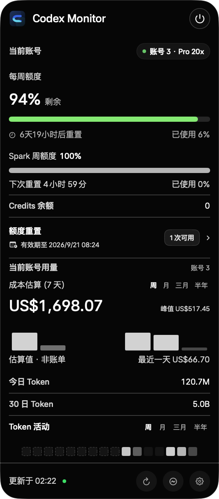

<div align="center">

# Codex Monitor for macOS

**把 Codex 的额度、Token、成本、实时任务、重置信号和本机会话集中到一个原生 macOS 应用中。**

[](https://www.apple.com/macos/)
[](Package.swift)
[](scripts/build-app.sh)
[](#数据来源准确性与隐私边界)
[](LICENSE)

由 [CoverAI](https://coverai.store/?utm_source=github&utm_medium=repository&utm_campaign=codex_monitor_readme) 构建。

</div>

> [!IMPORTANT]
> 最新版本为 [`v1.5.0 (Build 11)`](https://github.com/suguxiaojie/codex-notch-monitor/releases/tag/v1.5.0)。Release 分别提供 Apple Silicon `arm64` 与 Intel `x86_64` 安装包，请按 Mac 处理器选择对应 DMG。

## 目录

- [这个 App 做什么](#这个-app-做什么)
- [界面预览](#界面预览)
- [功能详解](#功能详解)
- [数据来源、准确性与隐私边界](#数据来源准确性与隐私边界)
- [系统要求](#系统要求)
- [从源码运行与安装](#从源码运行与安装)
- [首次安装与权限引导](#首次安装与权限引导)
- [Hook 事件与状态映射](#hook-事件与状态映射)
- [会话导出、导入与恢复](#会话导出导入与恢复)
- [本地文件与网络请求](#本地文件与网络请求)
- [开发、测试与构建](#开发测试与构建)
- [常见问题](#常见问题)
- [已知边界](#已知边界)

## 这个 App 做什么

Codex Monitor 是一个使用 SwiftUI 与 AppKit 构建的原生 macOS 菜单栏应用。它把原本分散在 Codex App Server、本地会话日志、Codex lifecycle Hooks 和公开社区信号中的信息，整理成三个使用层级：

1. **菜单栏与 Glance 面板**：快速看当前账号额度、重置时间、Credits、成本和 Token 活动。
2. **灵动岛与任务状态**：在不切回 Codex 的情况下查看任务运行、工具调用、等待批准和完成状态。
3. **Monitor Center**：完整查看 Usage、Cost、动态中心、会话管理、面板设置、安装权限和灵动岛设置。

应用不会把“官方额度”“本地统计”“社区预测”和“本地推断”混成一个可信度层级。界面与本文都会明确标注来源。

## 界面预览

### Glance 展开面板

<p align="center">
  
</p>

Glance 只聚焦当前账号，把周额度、Spark 额度、Credits、额度重置入口、成本估算、今日与 30 日 Token、Token 活动集中在一个窄面板中。底部按钮分别用于刷新、打开动态中心和进入完整 Monitor Center。

### Usage 与 Cost

<p align="center">
  
  
</p>

Usage 与 Cost 使用相同的账号范围、周期选择、字体层级和卡片结构。顶部的“日／周／月”是唯一统计周期：分别对应当前自然日、最近 7 个统计日和最近 30 个统计日，并同步影响总量、趋势或活动、会话数、项目数及项目排行。

### 动态中心

<p align="center">
  
</p>

动态中心把官方额度状态与第三方社区雷达分开呈现：额度百分比来自 Codex App Server；Tibo 动态、重置时间轴与概率预测来自 `codex-reset.com`，不是 OpenAI 官方接口。

### 会话管理

<p align="center">
  
</p>

会话管理展示当前账号、本地项目与会话数量、已归档和待恢复状态，并提供会话包／完整项目迁移包导入。项目与会话操作收在省略号菜单中；基线前无法可靠归属的历史明确保留为“归属未知”。

### 面板设置与灵动岛设置

<p align="center">
  
  
</p>

面板设置用于控制 Glance 中额度、Credits、重置入口、Token 与成本模块；灵动岛设置用于切换浮动状态岛或仅菜单栏模式，并调整信息密度、透明度、缩放、动画和完成反馈。

### 菜单栏额度环

<p align="center">
  
</p>

菜单栏额度环显示当前账号最需要关注的额度窗口。带刘海的 MacBook 会把可读信息放在摄像头左右安全翼；无刘海屏幕和外接显示器会自动使用顶部胶囊布局。

## 功能详解

### 1. 菜单栏与 Glance 概览

Glance 是日常使用频率最高的面板，只展示**当前真实账号**，不在紧凑面板中混入其他历史账号。

- 显示当前账号、套餐类型和在线状态。
- 显示 Codex 周额度、短周期额度和 App Server 返回的其他额度桶。
- 每个额度窗口独立显示剩余百分比、已用比例和精确重置倒计时。
- 支持 Spark 等独立额度窗口；不存在的窗口不会制造空卡片。
- 显示当前 Credits 余额。
- 显示可用的额度重置次数、有效期和手动重置入口。
- 显示本地 API 等价成本、今日 Token、30 日 Token 与 Token 活动。
- 周／月／三月／半年仅用于 Glance 内的成本和 Token 活动观察，不改变 Monitor Center 的日／周／月统计口径。
- 底部提供刷新、打开 Monitor Center、灵动岛设置和退出入口。
- “面板设置”可以逐项显示或隐藏额度、成本、Credits、Token 活动和重置入口，并调整面板透明度。

手动重置指用户在额度重置卡中主动消耗 reset credit 的操作；它与自然到期重置、Tibo 宣布的临时重置是三种不同记录类型。

### 2. Usage：Token 与项目用量

Usage 从本机 Codex 结构化会话日志中统计 Token，不依赖屏幕识别，也不把趋势图做成累计曲线。

- 扫描 `~/.codex/sessions/` 与 `~/.codex/archived_sessions/`。
- 按结构化 Token 事件去重；同一会话在活动区和归档区短暂共存时不会重复计数。
- 支持“日／周／月”三种统一周期。
- 显示 Token 总量及输入、输出、缓存拆分。
- 显示会话数、项目数和按项目聚合的用量排行。
- 项目统计使用完整路径作为稳定主键，显示名称优先使用 Codex 本地侧栏别名。
- 趋势模式显示按小时或自然日分桶的非累计折线；只绘制到当前时间，不把未来空桶画成突然归零。
- 活动模式使用 Token 密度热图查看不同日期的活跃程度。
- 悬停折线或活动格时显示对应时间点和精确 Token。
- 同一会话对应的项目路径发生可靠变更时，会用最新结构化证据更新项目归属。
- 账号范围可选择综合统计、已观察账号或归属未知记录；不会把基线前历史猜给当前账号。

### 3. Cost：API 等价成本

Cost 与 Usage 复用同一次本地结构化日志扫描，并保持相同的周期、账号和项目口径。

- 显示日／周／月 API 等价美元成本。
- 分开计算输入、输出、缓存写入和缓存读取 Token。
- 显示 Token 吞吐量、每小时或每日成本趋势及本地日志来源。
- 模型价格每天从公开的 [CodexIsland Model Catalog](https://ericjypark.github.io/codex-island-model-catalog/v1/models.json) 刷新，并保留随应用打包的后备价格表。
- 远程价格目录有 schema、大小、数值范围和缓存校验；刷新失败时继续使用上一次有效缓存或内置后备表。
- 未知模型不会猜价格：界面会列出该模型，并按 `$0` 计入估算。
- Codex 内部自动路由模型只在有本地时间线证据时映射到当时的主模型，映射关系会在界面说明。

> [!WARNING]
> Cost 是按公开模型单价换算的 **API 等价估值**，不是 ChatGPT/Codex 订阅账单，也不代表用户实际需要支付这笔费用。

### 4. 动态中心：官方额度、Tibo 动态与重置时间轴

动态中心保留全部动态，同时用分层和筛选减少视觉噪声。

- 顶部“官方额度”卡读取 `account/rateLimits/read`，显示真实额度窗口与健康状态。
- 社区预测单独标为“社区预测”和对应置信度，不伪装成官方结论。
- “动态”模式保留 `@thsottiaux` 的完整相关时间线，并按日期分组。
- 支持“全部／重置信号／额度动态”筛选。
- 置顶信号用于展示最近一条已确认或需要重点关注的额度事件。
- “重置时间轴”按事件关系呈现预告、到达、确认、归档和证据链接，而不是普通列表换一个标题。
- 每条内容保留原文链接、来源账号、发布时间和互动数据；可直接跳转到 X 查看证据。
- macOS 15 及以上可使用系统 Translation 框架翻译为简体中文；翻译结果只在当前进程内存中缓存。
- 网络失败或上游延迟时保留最后一次通过校验的缓存，并明确显示“数据可能延迟”。

雷达数据通过以下公开接口读取：

```text
https://codex-reset.com/api/feed?locale=zh
https://codex-reset.com/api/timeline?locale=zh
https://codex-reset.com/api/forecast?locale=zh
```

客户端会验证数据版本、来源范围、`@thsottiaux` 账号、时间字段、X 链接、条数上限和概率范围。通过这些校验只能证明“数据符合当前约定”，不能把第三方源提升为 OpenAI 官方接口。

### 5. 额度恢复监控与三种重置类型

应用会比较同一账号同一额度窗口的前后状态，并结合 App Server 的 `resetsAt`、用户动作和 Tibo 证据判断恢复原因：

| 类型 | 判断依据 | 含义 |
|---|---|---|
| Tibo 重置 | 额度恢复时间与经过校验的 Tibo 重置信号匹配 | 社区渠道发布并实际到达账号的临时或计划重置 |
| 到期重置 | 额度窗口在 `resetsAt` 附近自然恢复 | 正常周期到期 |
| 手动重置 | 用户在本 App 中点击额度重置卡并消耗 reset credit | 用户主动触发 |

证据不足的额度跳变会先进入待核验，不会因为首次启动、切换账号或接口瞬时抖动立即发送错误通知。恢复记录支持按类型筛选，也允许用户修改**显示类型**；修改只写入 `userDisplayType`，原始判断原因仍保留，并在写入前创建时间戳备份。

### 6. 实时任务与灵动岛

应用同时使用本地结构化会话活动和可选 lifecycle Hooks 显示任务状态。

- 支持“正在开始、正在执行工具、正在思考、等待批准、已完成、会话结束”等阶段。
- 同一路径的多个会话聚合为一个项目，并显示运行会话数。
- 可区分读取、搜索、修改、验证、图片检查和普通命令等动作类型。
- 命令摘要会截断并遮盖常见 Token、密钥和密码参数。
- 菜单栏可选择自动、详细、精简或仅图标密度。
- 浮动灵动岛支持显示／隐藏、缩放、透明度、位置、内容密度和动画设置。
- 等待批准时使用高优先级状态；普通运行和空闲采用不同颜色与呼吸节奏。
- 浮动岛不适合当前工作流时，可切换为“仅菜单栏”。

不安装 Hooks 时，应用仍能从本地会话结构识别部分活动；“等待批准”等精细阶段需要信任 lifecycle Hooks。

### 7. 会话管理与账号连续性

会话管理面向同一台 Mac 上的 Codex 本地会话与项目，不把本地文件存在、App Server 可见和 Codex 侧栏显示混成同一个状态。

- 使用 Codex App Server `account/read` 获取当前账号信息。
- 原始账号标识不会直接落盘；ChatGPT 登录使用本机随机盐生成指纹，并只显示脱敏邮箱。
- 账号状态监听只观察 Codex 账号状态文件的修改时间、大小和文件编号，不读取其内容。
- 同时盘点活动与归档 JSONL，并显示项目数、会话数、已归档数、待恢复数和归属未知数。
- 基线前的历史会话保持“归属未知”，不会被自动分配给当前账号。
- 项目和会话动作统一收在省略号菜单，避免导出与删除按钮占据列表主层级。
- 支持脱敏 Markdown、脱敏自包含 HTML、原始会话恢复包和完整项目迁移包。
- 支持安全预检、缺失项目路径手动映射、重复 ID 跳过或生成新 ID、事务备份、App Server 可见性检查和回滚。
- 支持永久删除单会话、仅移除 Codex 项目登记，或把明确选择的项目目录移到 macOS 废纸篓；这些写操作都需要用户在界面中再次确认。

### 8. 面板设置、安装与权限

Monitor Center 当前包含七个页面：

| 页面 | 作用 |
|---|---|
| Usage | Token、会话、项目和额度概览 |
| Cost | API 等价成本与本地日志来源 |
| 动态中心 | 官方额度、Tibo 动态、预测和重置时间轴 |
| 会话管理 | 账号连续性、本地会话、导入导出与恢复 |
| 面板设置 | 控制 Glance 中额度、用量、成本和操作入口 |
| 安装与权限 | 首次引导、通知权限、Hook 安装／审核／连接验证 |
| 灵动岛设置 | 菜单栏与浮动灵动岛的外观、位置、缩放和动画 |

## 数据来源、准确性与隐私边界

### 数据来源与可信度

| 数据 | 来源 | 可信度定位 | 更新方式与边界 |
|---|---|---|---|
| 当前账号与额度窗口 | Codex App Server：`account/read`、`account/rateLimits/read` | 官方本机接口 | 手动刷新、应用刷新周期及 App Server 推送；接口不可用时显示旧值或 `--%` |
| Usage Token | 本机 `sessions`／`archived_sessions` 结构化 `token_count` 事件 | 本地一手记录 | 刷新时扫描并缓存；只能覆盖当前机器仍可读取的本地历史 |
| 实时任务阶段 | Codex lifecycle Hooks＋本地结构化事件 | 官方机制产生的本地事件 | Hook 未安装或未信任时精细状态不完整 |
| Cost | 本地 Token × 公开模型单价 | 本地推算 | 是 API 等价估值，不是订阅账单；未知模型不估价 |
| Tibo 动态与时间轴 | `codex-reset.com` 对公开 X 内容的聚合接口 | 第三方社区源 | 默认每 3 分钟刷新；超过 10 分钟视为可能陈旧；上游失败时保留校验后的缓存 |
| 24h／48h 重置概率 | `codex-reset.com` forecast | 第三方预测 | 仅作辅助观察，不是 OpenAI 承诺 |
| 重置类型 | App Server 时间窗、用户动作、Tibo 证据的本地规则 | 本地证据推断 | 证据不足先待核验；用户可只修改显示类型 |

### 正常监控不会读取什么

- 不读取或输出 `auth.json`、Cookie、Token、API Key 或密码。
- Hook Helper 只保留 `session_id`、`turn_id`、`cwd`、`hook_event_name`、`model`、`tool_name` 和接收时间。
- 正常 Usage、Cost 和任务监控不读取提示词正文、完整模型回复、推理内容或完整工具输出。
- 不扫描项目源码内容来计算 Usage 或 Cost。
- 不把本地账号、项目名、会话、Token 用量或额度数据上传给动态源或模型价格目录。

### 需要特别注意的用户主动操作

- 导出脱敏 Markdown／HTML 时，应用会在本机读取所选会话的用户消息和最终回复，用于生成可读文件，并执行敏感文本遮盖。
- 原始 `.codexmonitorbundle` 与完整项目迁移包可能包含提示词、源码、终端输出、绝对路径、图片和其他附件，只适合作为私有备份，不应公开上传。
- 会话导入、恢复、删除、项目迁移、Hook 安装／卸载和手动额度重置会写入本机状态；应用会在操作前展示范围，并在支持的路径创建备份。
- 点击 CoverAI 或 X 链接会打开外部网站；只有用户主动点击才会跳转。

## 系统要求

### 运行已构建 App

- macOS 13 Ventura 或更新版本。
- Apple Silicon Mac，或 64 位 Intel Mac。
- 已安装并登录 Codex／ChatGPT Desktop；没有登录时官方账号和额度不可用。
- macOS 15 或更新版本才支持系统 Translation 翻译动态内容。

### 从源码构建

- Xcode Command Line Tools 或包含 Swift 6 工具链的 Xcode。
- `git`、`swift`、`codesign`、`lipo`；构建 DMG 还需要系统自带的 `hdiutil`。
- 不需要额外第三方 Swift Package 依赖。

## 从源码运行与安装

### 1. 克隆并验证

```bash
git clone https://github.com/suguxiaojie/codex-notch-monitor.git
cd codex-notch-monitor
./scripts/test.sh
```

### 2. 构建当前 Mac 的原生架构版本

```bash
./scripts/build-app.sh native
open build/CodexNotchMonitor.app
```

构建产物：

```text
build/CodexNotchMonitor.app
```

### 3. 构建 Universal 2

```bash
./scripts/build-app.sh universal
```

Universal 构建会分别编译主程序与 `CodexMonitorHook` 的 `arm64`、`x86_64` 版本，再用 `lipo` 合并，最后执行 ad-hoc 签名。

### 4. 安装到 `/Applications`

```bash
./scripts/install-app.sh universal
```

安装脚本会：

1. 重新构建并签名应用。
2. 把已存在的 `/Applications/CodexNotchMonitor.app` 备份到 `build/backups/`。
3. 替换应用并验证签名。
4. **保留现有 Hook 配置，不自动修改 `~/.codex/hooks.json`。**
5. 启动新安装的 App。

### 5. 构建 DMG

```bash
./scripts/build-dmg.sh
```

默认生成 Universal 2 只读压缩镜像：

```text
build/CodexNotchMonitor-v<version>-universal.dmg
```

当前使用 ad-hoc 本地签名，尚未接入 Apple Developer ID 公证。首次打开若被 Gatekeeper 拦截，请在“系统设置 → 隐私与安全性”中核对应用来源后手动允许；不要通过来源不明的脚本移除整机安全属性。

## 首次安装与权限引导

首次运行会自动进入“安装与权限”。整个流程可以跳过，并可稍后从 Monitor Center 重新打开；当前步骤会持久化，切换页面或重启 App 后继续原步骤。

### 五步流程

1. **欢迎**：解释本地数据范围、可选能力和不会读取的内容。
2. **环境检查**：只读检查 Codex CLI、Bundle Helper 和 `~/.codex/hooks.json` 是否可安全解析；这一页不修改文件，也不会提前显示后续审核状态。
3. **通知**：只有点击“允许通知”才请求 macOS 通知权限。
4. **Hooks**：用户确认后备份并合并 Hook 配置、安装稳定 Helper，再由用户在 Codex 原生审核菜单中完成信任。
5. **验证**：完全退出并重启 Codex，发送一条真实消息；应用收到与当前安装哈希匹配的首条 Hook 事件后才显示连接正常。

### Hook 安装会修改什么

只有用户在 App 中点击并确认“备份并安装／更新 Hook”后，才会：

- 把 Helper 复制到：

  ```text
  ~/Library/Application Support/CodexNotchMonitor/Helpers/CodexMonitorHook
  ```

- 备份现有 `~/.codex/hooks.json` 和旧 Helper。
- 合并九类当前用户事件，保留其他应用或用户已有的 Hooks。
- 使用带 shell 引号的稳定 Helper 路径，兼容 `Application Support` 中的空格。
- 把每次同步 Hook 的等待上限设为 2 秒。
- 让 Helper 只写入一个小型本地事件文件，不发起网络请求。

Hook 安装后仍需要用户亲自完成 Codex 安全审核：

1. 在 App 中点击“进入安全审核”。
2. Codex 原生终端菜单出现 `Hooks need review`。
3. 使用方向键选择 `2. Trust all and continue`，按 Enter。
4. 返回 App，点击“我已完成安全审核”并确认。
5. 使用 `Cmd + Q` 完全退出 Codex，再重新打开并发送一条正常消息。

应用不会用 Expect 或自动按键替用户信任 Hooks，也不会创建测试会话来伪造连接成功。

### Hook 状态说明

| 状态 | 含义 | 建议操作 |
|---|---|---|
| 未安装 | 当前配置没有完整的 Codex Monitor Hooks | 备份并安装，或跳过 |
| 需要更新 Hook | 已发现旧定义或 Helper 与当前 App 不一致 | 备份并更新，然后重新审核 |
| 需要安全审核 | 当前 Hook 已安装，但本次定义尚未由用户确认 | 打开 Codex 原生审核菜单 |
| 安全审核进行中 | 审核终端已经打开 | 在现有窗口完成，不要重复启动 |
| 等待首条真实消息 | 审核哈希已记录，但尚未收到当前安装的真实事件 | 完全退出并重启 Codex，再发送正常消息 |
| 连接正常 | 已收到与当前安装匹配的真实 Hook 事件 | 无需操作 |
| Hooks 配置无法解析 | `hooks.json` 不是安全可合并的 JSON | 修复配置后重试；应用不会覆盖原文件 |

命令行用户也可以运行 `scripts/install-hooks.py`，但仍必须在 Codex 中完成安全审核。推荐优先使用 App 内引导，因为它能显示安装哈希、审核状态和首条真实事件验证。

## Hook 事件与状态映射

| Codex Hook | App 中的阶段 |
|---|---|
| `SessionStart` | 正在开始 |
| `UserPromptSubmit` | 正在开始 |
| `PreToolUse` | 正在执行工具 |
| `PostToolUse` | 正在思考 |
| `PermissionRequest` | 等待你的批准 |
| `SubagentStart` | 正在思考 |
| `SubagentStop` | 任务已完成 |
| `Stop` | 任务已完成 |
| `SessionEnd` | 会话已结束 |

Helper 总是以成功状态退出，避免监控故障阻断 Codex 正常工作。应用只消费 Helper 写入的结构化事件，不把 Hook 输入转发到网络。

## 会话导出、导入与恢复

### 可读导出

- **Markdown**：适合私下阅读和交接，默认执行敏感文本遮盖。
- **自包含 HTML**：包含样式，可直接在浏览器打开，同样执行脱敏。
- 导出过程显示授权、扫描、生成、压缩和完成状态；不会调用 `thread/start` 或 `turn/start`，不会创建新会话或消耗额度。

### 原始会话备份

`.codexmonitorbundle` 使用 `codex-notch-session/v1` 格式，包含：

- Manifest 与版本信息。
- 每个文件的 SHA-256。
- 活动／归档状态。
- 项目路径和可靠观察到的账号别名。
- 原始 JSONL。

导入前会拒绝 zip-slip、符号链接、错误 Manifest、错误 checksum、内部 ID 不一致和未经映射的缺失项目路径。同 ID 默认跳过，也可以显式生成新 ID 作为副本。写入前创建事务备份，写入后分别报告本地文件状态与 App Server 可见性。

### 完整项目迁移

完整项目迁移包可以包含项目文件、Git 工作区和相关会话。导入时支持：

- 先预检，不直接覆盖目标。
- 缺失目录手动映射。
- 排除部署包、归档、大型生成物和明显敏感文件。
- 所有会话 ID 冲突时阻止创建空项目。
- 只补会话而不覆盖项目文件。
- 导入失败时按事务备份回滚。

任何恢复或清理操作都应在 Codex 完全退出后执行，以免运行中的 Codex 用旧内存状态覆盖刚写入的索引。

## 本地文件与网络请求

### 主要本地路径

| 路径 | 默认行为 | 何时写入 |
|---|---|---|
| `~/.codex/sessions/` | 读取结构化会话与 Token 事件 | 仅用户主动导入／恢复时 |
| `~/.codex/archived_sessions/` | 读取归档会话与 Token 事件 | 仅用户主动导入／恢复时 |
| `~/.codex/hooks.json` | 环境检查时只读 | 用户确认安装、更新或卸载 Hook 时；操作前备份 |
| `~/Library/Application Support/CodexNotchMonitor/events/` | 消费本地 Hook 事件 | Hook Helper 写入小型事件文件 |
| `~/Library/Application Support/CodexNotchMonitor/account-continuity.json` | 保存本机账号连续性证据 | 观察到可靠账号切换或会话归属时 |
| `~/Library/Application Support/CodexNotchMonitor/quota-reset-state.json` | 保存额度快照、待核验和恢复历史 | 额度状态发生可靠变化时 |
| `~/Library/Application Support/CodexNotchMonitor/continuity-backups/` | 保存导入、恢复和清理事务备份 | 用户主动执行对应写操作前 |
| `~/Library/Application Support/CodexNotchMonitor/setup-backups/` | 保存 Hook 配置和 Helper 备份 | 用户确认安装、更新或卸载 Hook 前 |
| `~/Library/Caches/com.coverai.codex-notch-monitor/model-prices.json` | 保存已校验模型价格目录 | 价格刷新成功时 |

### 外部网络请求

| 目标 | 目的 | 是否携带本地统计 |
|---|---|---|
| Codex App Server 本机进程 | 账号、额度、状态库可见性 | 本机 IPC，不是公开网络请求 |
| `codex-reset.com` | 动态、时间轴和预测 | 否 |
| `ericjypark.github.io` | 公开模型价格目录 | 否 |
| `coverai.store` | 用户主动点击官网入口 | 只有点击时打开；不附加本机数据 |
| `x.com` | 用户主动查看动态证据 | 只有点击时打开 |

## 开发、测试与构建

### 运行完整测试

```bash
./scripts/test.sh
```

测试脚本覆盖：

- App Server 模型解析、额度窗口与菜单栏额度环。
- Ripple／Particle Orb 运行时和灵动岛生命周期。
- 灵动岛偏好与布局状态。
- 首次安装、Hook 合并、路径引号、审核状态和连接状态。
- Usage／Cost 扫描、账号归属、项目别名、活动热图和价格目录。
- Tibo／Codex Reset Radar 解码、来源校验、缓存与时间轴。
- 额度恢复三分类、待核验、用户显示类型和通知证据。
- 会话连续性、导出、导入、完整项目迁移、删除队列、备份和回滚。
- Python Hook 安装／卸载脚本。

### 架构与签名验证

```bash
lipo -archs build/CodexNotchMonitor.app/Contents/MacOS/CodexNotchMonitor
lipo -archs build/CodexNotchMonitor.app/Contents/Helpers/CodexMonitorHook
codesign --verify --deep --strict build/CodexNotchMonitor.app
```

Universal 版本的两个二进制都应同时包含 `arm64` 和 `x86_64`。

### 主要代码结构

```text
Sources/CodexNotchMonitor/
  App.swift                         生命周期与窗口编排
  GlanceView.swift                  菜单栏概览面板
  NotchView.swift                   Monitor Center 主要页面
  MonitorStore.swift                数据刷新、状态组合与操作编排
  QuotaService.swift                Codex App Server 额度与 reset credit
  CostService.swift                 Usage／Cost 本地日志扫描与聚合
  PricingCatalog.swift              公开模型价格目录与缓存
  CodexResetRadarService.swift       codex-reset.com 动态／时间轴／预测
  QuotaResetMonitor.swift            额度恢复证据与三分类
  SessionContinuityService.swift     本地会话盘点与 App Server 可见性
  SessionExportService.swift         Markdown／HTML／会话包导出
  SessionImportService.swift         会话包预检、导入、备份与回滚
  ProjectTransferService.swift       完整项目迁移
  CodexSetupService.swift            首次引导、Hook 安装与审核状态
  SetupPermissionsView.swift         安装与权限界面
  ActivityIslandView.swift           浮动灵动岛视图
  ActivityIslandWindowController.swift
                                     浮动灵动岛窗口与生命周期

Sources/CodexMonitorHook/
  main.swift                          极小的本地 Hook Relay Helper

Tests/                                Swift 与 Python 定向测试
scripts/                              测试、构建、安装与 Hook 脚本
Resources/                            Info.plist、字体、Logo 与 Shader
docs/images/                          README 当前真实界面截图
```

## 常见问题

### 额度显示 `--%` 或一直刷新失败

这通常表示本机 Codex App Server 当前不可用、未登录或请求超时。应用会保留上一次成功值并退避重试；先确认 Codex 已正常启动并登录，再点击刷新。`--%` 不等于额度为 0。

### 另一个账号的 Usage／Cost 看起来是 0

先在 Monitor Center 的“统计范围”中选择对应账号，并确认当前周期。应用只把有可靠证据的会话归给该账号；首次启用前或离线切换期间无法确认的历史会保留在“归属未知”，不会为了填满数字而猜测。

### 安全审核后仍显示“等待首条真实消息”

1. 使用 `Cmd + Q` 完全退出 Codex，而不是只关闭窗口。
2. 重新打开 Codex，并发送一条普通用户消息。
3. 回到“安装与权限”点击刷新。
4. 如果状态变成“需要更新 Hook”，先用 App 内流程备份并更新，再重新审核。
5. 不要重复打开多个审核终端，也不要通过制造测试会话绕过真实事件验证。

“审核完成”和“连接正常”是两个状态：前者只说明用户确认了当前 Hook 定义，后者必须由当前 Helper 的真实事件证明。

### 动态中心显示旧数据或“数据可能延迟”

动态中心依赖第三方 `codex-reset.com`。网络失败、接口延迟或响应校验失败时，应用会继续展示最后一次有效缓存。此时应以官方额度卡和 X 原文链接为准，不应把预测值当作官方承诺。

### Cost 中某个模型显示未知或 `$0`

模型名称可能尚未进入公开价格目录，也可能是没有可验证公开价格的内部路由。应用不会给未知模型编造单价，因此按 `$0` 计入，并在来源卡中列出。

### Hook 是必需的吗

不是。官方额度、Usage、Cost、动态中心和大部分本地会话盘点不依赖 Hook。Hook 主要补充实时生命周期阶段，尤其是工具调用和等待批准。

### 为什么会话写入成功但 Codex 侧栏仍不可见

本地 JSONL 已存在、App Server 已索引和 Codex UI 已显示是三个不同阶段。会话管理会分别报告这些状态。必要时完全退出 Codex 后执行恢复，并使用 App Server 可见性检查；不要直接把“文件已复制”当作“恢复完成”。

## 已知边界

- App Server 返回的是额度窗口使用比例和重置时间，不是固定“剩余消息条数”。
- 独立启动的 App Server 进程不一定能看到另一个正在运行的 Codex Desktop 内存任务；本 App 通过 Hooks 与本地结构化记录补齐运行状态。
- 账号归属采用“从启用后观察”的证据口径；基线前历史、离线期间创建并在下一次观察前切换账号的会话可能保持未知。
- API Key 登录若没有稳定账号标识，无法可靠区分两把不同 Key，应用不会宣称已识别切换。
- 当前只处理 Codex 本地日志，不扫描 Claude 或 OpenCode 日志。
- 动态中心不是 OpenAI 官方消息源；Tibo 动态和社区概率只能作为额度变化的辅助证据。
- Cost 不是账单；模型公开价格变化会影响估算，未知模型按 `$0`。
- 原始会话和项目迁移包含敏感内容，不适合公开分享。
- 当前使用 ad-hoc 签名，没有 Developer ID 公证、自动更新签名或已发布 GitHub Release。

## 官方协议依据

- [Codex App Server](https://learn.chatgpt.com/docs/app-server)
- [Codex Hooks](https://learn.chatgpt.com/docs/hooks)

## 参考与致谢

- Cost 数据口径、`last_token_usage` 处理、API 等价成本思路和部分交互语言参考 MIT 项目 [ericjypark/codex-island](https://github.com/ericjypark/codex-island)。
- 动态中心读取 [codex-reset.com](https://codex-reset.com/zh/tibo) 的公开聚合接口；该站点不是 OpenAI 官方服务。
- 第三方组件与许可说明见 [THIRD_PARTY_NOTICES.md](THIRD_PARTY_NOTICES.md)。

## 许可证

本项目使用 [MIT License](LICENSE)，Copyright (c) 2026 CoverAI。你可以在保留版权与许可声明的前提下使用、复制、修改、合并、发布、分发、再许可或销售本软件；软件按“原样”提供，不附带任何明示或默示担保。
